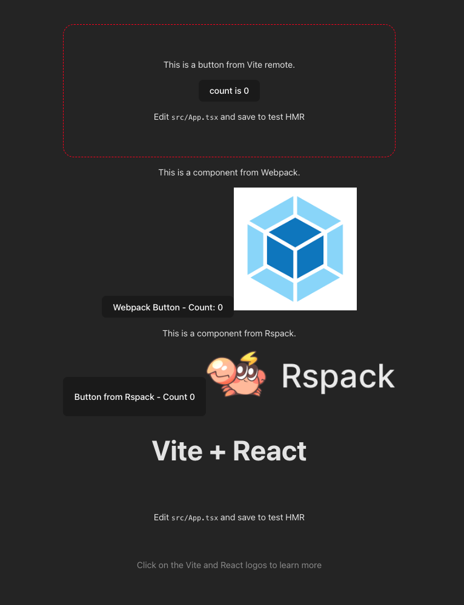

# React Micro-Frontend Example

A comprehensive micro-frontend setup demonstrating Module Federation with multiple bundlers working together.



## Technology Stack

- **Framework**: React 18
- **Architecture**: Module Federation
- **Host Application**: Vite
- **Remote Applications**:
  - Vite Remote (TypeScript)
  - Rspack Remote
  - Webpack Remote
- **Deployment**: Zephyr Cloud

## Prerequisites

- Node.js (version 16 or higher)
- pnpm (required for workspace management)

## Project Structure

This example consists of multiple applications:

- **`host/`** - Main host application built with Vite
- **`remote/`** - Remote application built with Vite
- **`rspack/`** - Remote application built with Rspack
- **`webpack/`** - Remote application built with Webpack

## Getting Started

1. **Install dependencies**
   ```bash
   pnpm install
   ```

2. **Build all applications** (in order)
   ```bash
   pnpm --filter=vite_remote build
   pnpm --filter=vite_rspack build
   pnpm --filter=vite_webpack build
   pnpm --filter=vite-host build
   ```

   Or use the convenience script:
   ```bash
   pnpm build
   ```

3. **Development mode**
   Each application can be run independently:
   ```bash
   # Host application (port 5173)
   cd host && pnpm dev
   
   # Remote applications
   cd remote && pnpm dev    # port 5174
   cd rspack && pnpm dev    # port 8080
   cd webpack && pnpm dev   # port 3000
   ```
   
   **Development URLs:**
   - **Host**: http://localhost:5173
   - **Vite Remote**: http://localhost:5174
   - **Rspack Remote**: http://localhost:8080
   - **Webpack Remote**: http://localhost:3000

## Zephyr Cloud Integration

This example demonstrates advanced micro-frontend deployment with Zephyr Cloud, showing how different bundlers can work together seamlessly in a federated architecture.

## About Module Federation

Module Federation allows multiple JavaScript applications to share components and dependencies at runtime. This example shows:
- **Multi-bundler compatibility**: Different remotes using different bundlers
- **Runtime composition**: Components loaded dynamically at runtime
- **Independent deployment**: Each remote can be deployed separately

## About Zephyr Cloud

Zephyr Cloud is a micro-frontend deployment platform that provides:
- **Auto-deployment**: Seamless deployment from your build process
- **Live preview links**: Instant preview URLs for your applications
- **SemVer versioning**: Semantic versioning for your frontend modules
- **Rollback capabilities**: Easy rollback to previous versions
- **Enterprise-scale orchestration**: Built for composable frontend systems

## Learn More

- [Module Federation Documentation](https://module-federation.io/)
- [Vite Documentation](https://vitejs.dev/)
- [Rspack Documentation](https://rspack.dev/)
- [Webpack Documentation](https://webpack.js.org/)
- [Zephyr Cloud Module Federation Guide](https://docs.zephyr-cloud.io/recipes/vite-rspack-webpack-mf)
