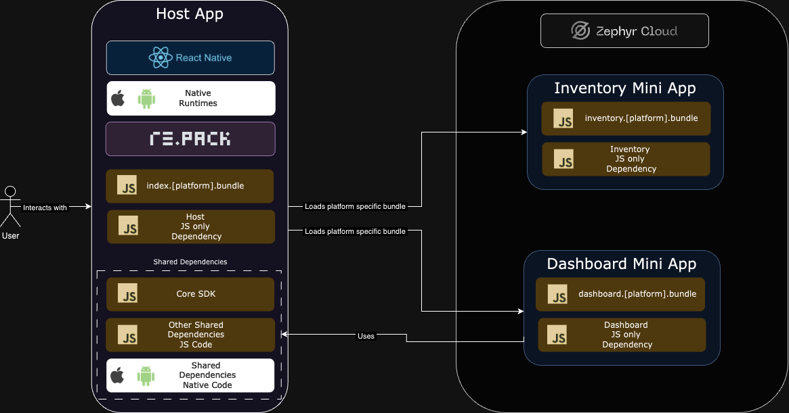
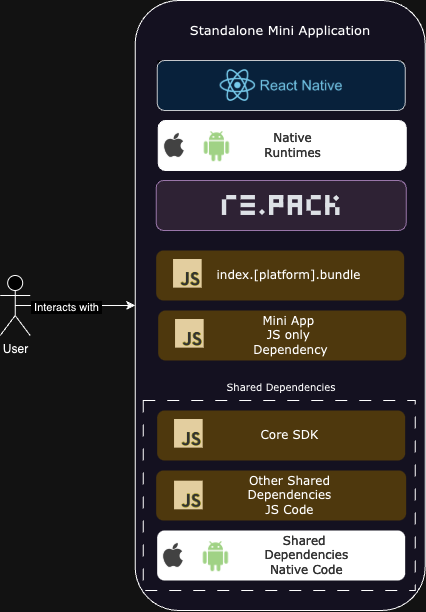
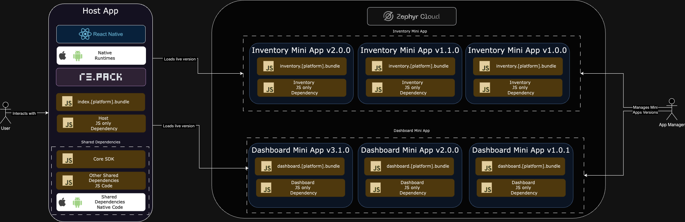

# React Native super app

| iOS | Android |
| --- | --- |
|  |  |


## Architecture Overview

Below you can find diagrams that illustrate the architecture of the React Native super app.

### High-level architecture



### Standalone app architecture



### Versioning architecture overview



## How to use

We use `pnpm` to manage dependencies. Learn how to install `pnpm` [here](https://pnpm.io/installation)

### Setup

Install dependencies for all apps:

```
pnpm install
```

[Optional] Install pods where applicable

```
pnpm pods
```

Pods might sometimes be outdated, and they might fail to install, in that case you can update them by running:

```
pnpm pods:update
```

### Run

Start dev server for Host and Mini apps:

```
pnpm start
```

Or start dev server for a specific app ([host](./apps/host/README.md) | [cart](./apps/cart/README.md)):

```
pnpm start:<app-name>
```

Or start dev server for a specific app as a standalone app. It's useful for testing micro-frontend as a standalone app:

```
pnpm start:standalone:<app-name>
```

Run iOS or Android app (ios | android):

```
pnpm run:<app-name>:<platform>
```

For Android, make sure to reverse all adb ports:

```
pnpm adbreverse
```

### Test

Run tests for all apps:

```
pnpm test
```

### Lint

Run linter for all apps:

```
pnpm lint
```

### Type check

Run type check for all apps:

```
pnpm typecheck
```
